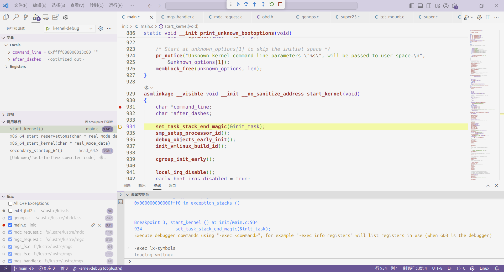

# Single-step Debugging of the Lustre File System with VSCode(GDB) and QEMU.

| [English](https://github.com/days0102/dbglustre) | [中文](https://blog.csdn.net/m0_52132972/article/details/140967116) |
| ------------------------------------------------ | ----------------------------------------------------------------- |

Here, I will introduce how to debug the Lustre file system using vscode(gdb) + qemu, which is useful for reading and understanding the Lustre source code. As a prerequisite, you need to identify the source code for the Linux kernel version you're using and successfully compile Lustre. For detailed instructions, you can refer to my other article: [Compiling and Installing Lustre on Ubuntu](https://blog.csdn.net/m0_52132972/article/details/140431565).

The following content will use the Ubuntu 5.19.0-41.42 source code as an example.
## 1. Obtaining the Source Code
### 1.1 Obtain the Linux kernel source code

Here, we also use the Ubuntu 5.19.0-41.42 source code (Linux kernel 5.19.17) as an example.

```
sudo apt install linux-source-5.19.0=5.19.0-41.42\~22.04.1
```

The downloaded source code will be located in the `/usr/src` directory, where you can extract it to obtain the Linux kernel.

```
tar jxvf /usr/src/linux-source-5.19.0.tar.bz2
```
### 1.2 Obtain the Lustre source code

Place the Lustre source code in the <font color="#c00000">fs</font> directory of the Linux source code.

```
cd fs
git clone git://git.whamcloud.com/fs/lustre-release.git
```
## 2. Debug the Linux kernel

The main method for debugging Lustre involves loading Lustre as a loadable kernel module and debugging it alongside the Linux kernel. First, you need to set up debugging for the Linux kernel itself.

### 2.1 Configuring Kernel Compilation Options

To facilitate the installation of the dependencies required for Lustre, it is necessary to support a Debian-based root filesystem for online package management. Here, I will use the root filesystem created by [runninglinuxkernel](https://github.com/runninglinuxkernel/runninglinuxkernel_5.0).

The kernel version of [runninglinuxkernel](https://github.com/runninglinuxkernel/runninglinuxkernel_5.0) is 5.0. First, we need to obtain several required files from it to compile and debug the kernel source code obtained in the previous step:

1. Configuration file: `.config`  
2. Script: `run_debian_x86_64.sh`  
3. Partially complete root filesystem fragments: `rootfs_debian_x86_64.part00/01`  

Place the above files in the root directory of the kernel code.

```
make menuconfig
```

Modify the following two options:

  │ Symbol: VERSION_SIGNATURE [=]  
  │ Type  : string   
  │ Defined at init/Kconfig:360  
  │   Prompt: **Arbitrary version signature**  
  │   Location:  
  │     Main menu   
  │ (1)   -> General setup  
  
  │ Symbol: GDB_SCRIPTS [=y]  
  │ Type  : bool   
  │ Defined at lib/Kconfig.debug:383  
  │   Prompt: **Provide GDB scripts for kernel debugging**  
  │   Depends on: DEBUG_INFO [=y]   
  │   Location:  
  │     Main menu  
  │       -> Kernel hacking  
  │ (1)     -> Compile-time checks and compiler options  

1. Change `Arbitrary version signature` to `Ubuntu` (since my source code is for Ubuntu). This allows Lustre to detect that the distribution is `Ubuntu` during the subsequent `configure` process.  
2. Enable `Provide GDB scripts for kernel debugging` to generate the `vmlinux-gdb.py` script.

### 2.2 Compiling the Kernel

```
make -j$(nproc)
```
### 2.3 Creating the Root Filesystem

```
sudo ./run_debian_x86_64.sh build_rootfs
```

After successful execution, you will obtain a file named `rootfs_debian_x86_64.ext4`, which is the created root filesystem.

> Note: The `rootfs_debian_x86_64.part` in [runninglinuxkernel](https://github.com/runninglinuxkernel/runninglinuxkernel_5.0) is based on Debian 10. Some of the software packages required for Lustre are outdated and may not meet the needs of newer versions of Lustre. Therefore, after starting, you can upgrade from Debian 10 to Debian 12. For guidance, you can refer to [Upgrading from Debian 10 to Debian 12](https://notes.junorz.com/docs/os/linux/upgrade-debian-10-to-12).


Open the `run_debian_x86_64.sh` file and delete the following two lines:

```
--fsdev local,id=kmod_dev,path=./kmodules,security_model=none \
-device virtio-9p-pci,fsdev=kmod_dev,mount_tag=kmod_mount\
```
### 2.4 Run and debug

Use `run` or `run debug` to run or debug the kernel.

```
./run_debian_x86_64.sh run
./run_debian_x86_64.sh run debug
```

During debugging, after running `run debug`, you can connect remotely using vscode or gdb to port `:1234` for debugging.

The `launch.json` configurations for debugging in vscode can be simply set up as follows, with other options adjusted according to your needs:

```json
{
	"name": "kernel-debug",
	"type": "cppdbg",
	"request": "launch",
	"program": "${workspaceFolder}/vmlinux",
	"args": [],
	"stopAtEntry": false,
	"cwd": "${workspaceFolder}",
	"environment": [],
	"externalConsole": false,
	"miDebuggerServerAddress": "127.0.0.1:1234",
	"miDebuggerPath": "/usr/bin/gdb",
	"MIMode": "gdb",
	"logging": {
		"engineLogging": false
	},
}
```
## 3. Single-Step Debugging of Lustre

### 3.1 Configuring Lustre

Place the Lustre source code in the `fs` directory of the Linux source code, then navigate to the Lustre directory and run the following command:

```
sh autogen.sh
./configure --with-linux=[linux-source-dir] --enable-client --enable-server --without-o2ib  --disable-strict-errors --disable-tests
```

> `linux-source-dir` refers to the Linux source code directory from the previous step.
### 3.2 Obtaining the ldiskfs Source Code

To apply a patch to the `ldiskfs` directory in the Lustre source code, follow these steps:

```
cd ldiskfs
make
```

### 3.3  Enabling Lustre File System Support in Linux

In the Lustre directory, create a `Kconfig` file and write the following content (other options can be customized as needed):

```
config LUSTRE_FS
      tristate "Lustre filesystem support"
      help
        Lustre file system.
```

In the `fs/Kconfig` file within the Linux source directory, add the following line to include the Lustre configuration:

```
source "fs/lustre/Kconfig"
```

To include Lustre in the Linux kernel build process, you need to modify the `fs/Makefile` file in the Linux source directory by adding an entry for Lustre.

```
obj-$(CONFIG_LUSTRE_FS) += lustre/
```

Next, enter the kernel configuration interface in the Linux directory

```
make menuconfig
```

Then, set the `Lustre filesystem support` to be compiled as a kernel module by following these steps in the `menuconfig` interface:

1. Navigate to `File systems`
2. Find `Lustre filesystem support`
3. Select as a Module: When you highlight `Lustre filesystem support`, press the `Space` key to change the selection to `<M>` (module). This indicates that Lustre will be compiled as a loadable kernel module.
4. Save the Configuration

> In theory, you could also use `<Y>` to specify that Lustre should be compiled and linked directly into the kernel. However, this approach requires significant modifications to Lustre. For instance, since `ldiskfs` is based on an ext4 patch, there may be overlapping variable or function definitions. Compiling and linking Lustre directly into the kernel could lead to redefinition issues and other complications.

### 3.4  Compiling and Installing the Lustre Kernel Module

Compile the kernel in the linux directory

```
make -j$(nproc)
```

Next, execute the following command to install the Lustre kernel module into the root file system:

```
sudo ./run_debian_x86_64.sh update_rootfs
```

### 3.5  Installing the Lustre Toolkit 

The above steps only installed the Lustre kernel module. You also need to install the toolkit, which includes executable files such as `mkfs`, `mount`, and `lfs`.

You can install using the following two methods:
1. In the Lustre directory, use `make debs` to create a deb installation package, then copy the `**-utils-**.deb` file to the root file system. After starting the system in QEMU, install this deb package.
2. Copy the compiled executable files from the `utils` directory directly into the root file system for use.
### 3.6  Debug

The `vmlinux-gdb.py` script is needed here. Ubuntu may restrict automatic loading of scripts to known safe directories. If GDB reports that it refuses to load `vmlinux-gdb.py`, you can modify your `.gdbinit` file to add a safe directory using the `add-auto-load-safe-path` command.

When starting the debugging process, you can set a breakpoint at `start_kernel` in `init/main.c`. After the breakpoint is triggered, execute the command `lx-symbols`. The `lx-symbols` command is included in the `vmlinux-gdb.py` script and is used to load the symbol tables for the Linux kernel and its modules, facilitating debugging of the kernel and the loaded modules.

After using `lx-symbols`, when the kernel modules are loaded, it will automatically load the symbol information for the kernel and the loaded modules, such as:

> -exec lx-symbols  
> loading vmlinux  
> scanning for modules in ...  
> loading @0xffffffffa0000000: ....  fs/lustre/libcfs/libcfs/libcfs.ko  
> loading @0xffffffffa0021000: .....  fs/lustre/lnet/lnet/lnet.ko  
> ...  

The `lustre_fill_super` function in the `fs/lustre/lustre/llite/super25.c` file is the entry point for mounting Lustre. You can set a breakpoint in this function and then perform the mount operation to verify if the debugging configuration is successful.

After modifying the source code and recompiling the kernel, you can update the root file system using the following command to install the new modules:

```
make -j$(nproc)
sudo ./run_debian_x86_64.sh update_rootfs
```

## Appendix: Example of Single-Step Debugging Using VSCode

1. Run `./run_debian_x86_64.sh run debug` in the terminal.
2. Set a breakpoint at `start_kernel`, and start debugging in VSCode, connecting to `:1234`.
3. Once the breakpoint is hit, execute the command `lx-symbols` in the debug console to automatically load the symbol information.
>
4. Set breakpoints in the Lustre code in VSCode, and perform Lustre-related operations in the QEMU guest.
>
5. You can see in the debug console that the debugging information for the modules will be automatically loaded, triggering the breakpoints.

At this point, you can perform single-step debugging of Lustre, which will help in better reading and understanding the Lustre source code.
